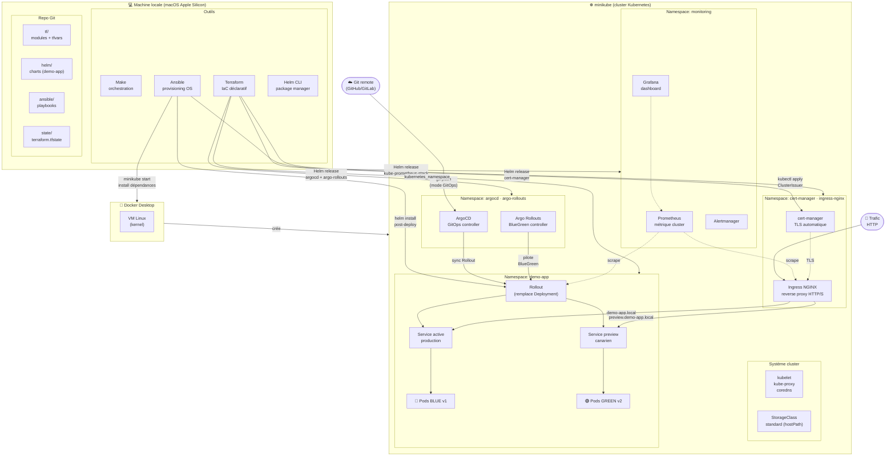
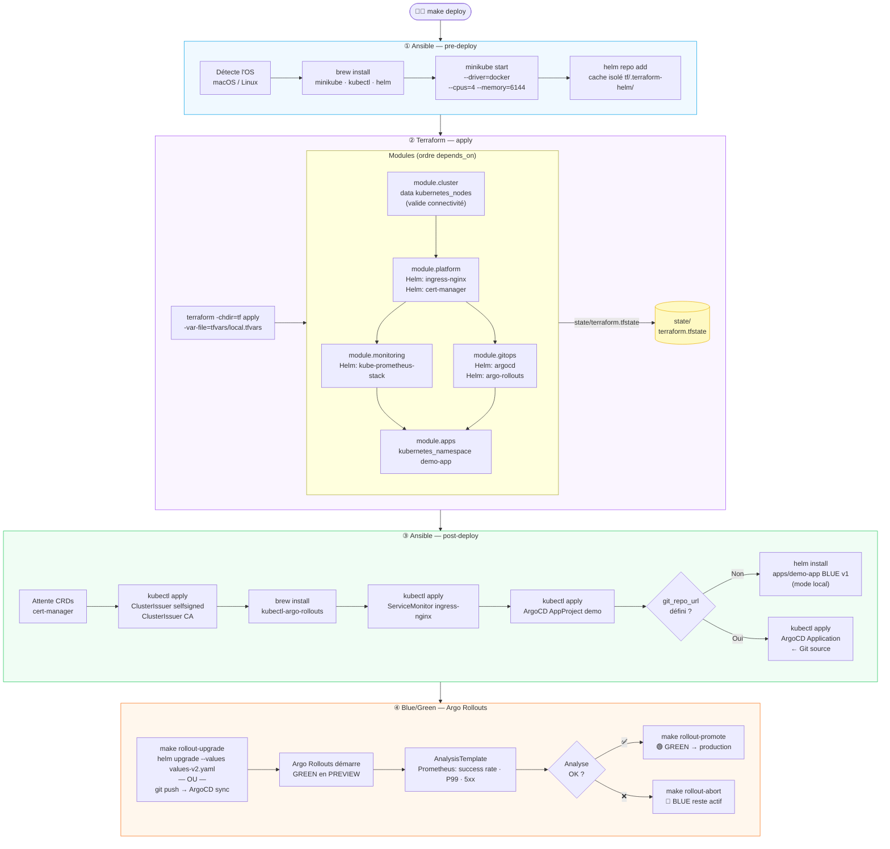
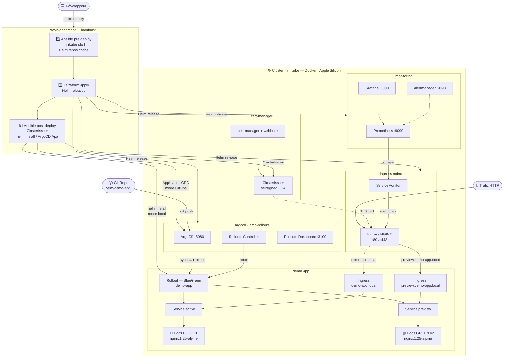
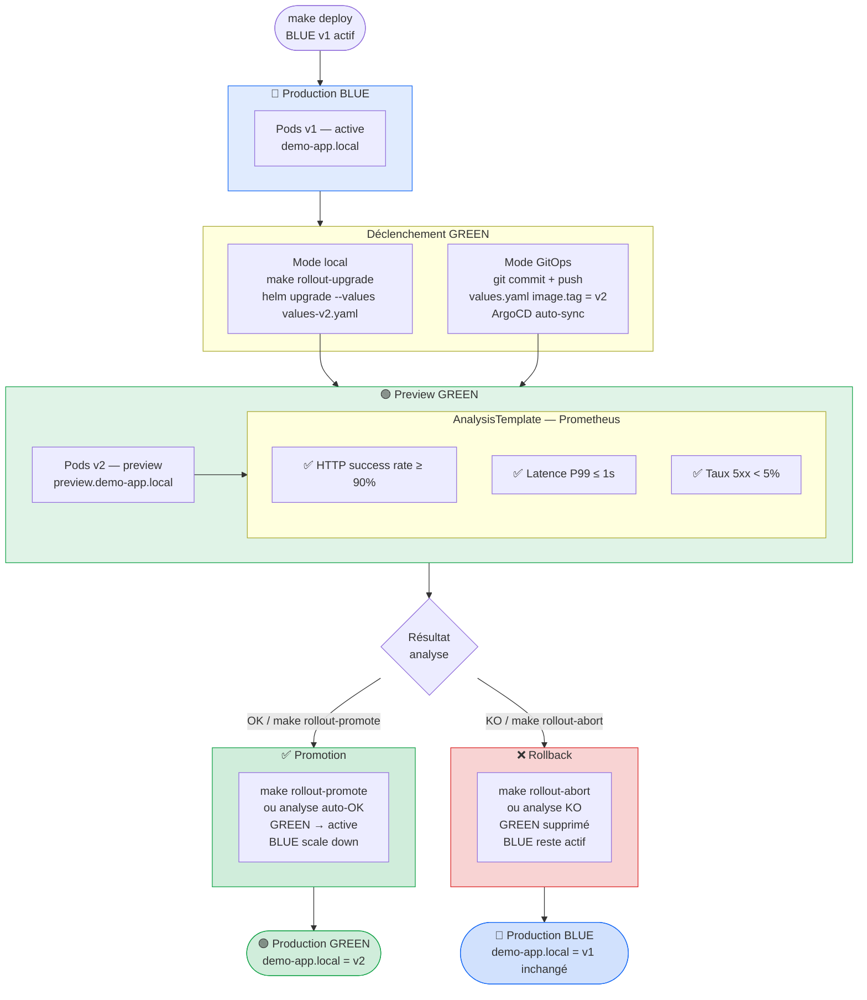

# Architecture — terraform-kube

## Infra — Point de vue DevOps

> Qui tourne quoi, sur quelle couche, avec quelle techno.

---

## Flow de déploiement — Point de vue DevOps

> Quelle techno déclenche quelle brique, dans quel ordre.

---

## Infrastructure globale

---

## Cycle Blue/Green — Argo Rollouts

